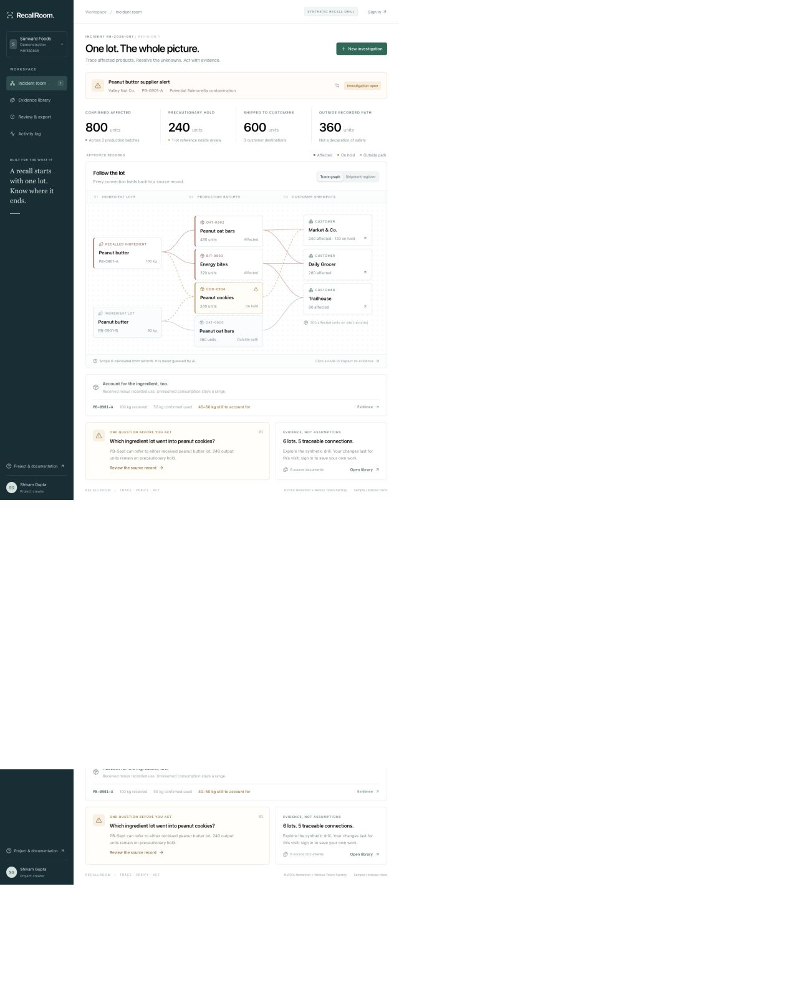

# RecallRoom

**A recall starts with one lot. Know where it ends.**

RecallRoom turns receiving logs, batch sheets and shipment records into an evidence-backed recall investigation. NVIDIA Nemotron proposes structured facts through Nebius Token Factory. Deterministic code traces the lots and checks quantities. A quality reviewer resolves uncertainty and controls every decision.

[Try the public synthetic drill](https://recallroom.sg127977958.chatgpt.site) · [Three-minute demo script](docs/submission/demo-script.md) · [Pitch deck](docs/pitch/RecallRoom-pitch.pdf) · [Product brief](docs/pitch/RecallRoom-product-brief.pdf) · [Architecture](docs/architecture.md) · [Commercial thesis](docs/submission/business-model.md)

Built for the **Nebius x NVIDIA Global AI Hackathon · Best Apps and Agents** by **Shivam Gupta**, with AI-assisted implementation and research.

> **Readiness:** the application, deterministic sample, provider adapter, and local tests are implemented. A real Nebius API key is required to verify live model execution. The sample never pretends to be a model response. Public video and final Devpost submission remain separate release gates. See [status](docs/STATUS.md).



## The 60-second judge walkthrough

1. Open the public drill; no account is needed. All organizations and records are fictional.
2. One recalled peanut butter lot reaches **800 finished units**, **600 dispatched units**, and **three customers**. Another **240 units stay on precautionary hold** because a batch sheet uses the ambiguous label `PB-Sept`.
3. Click a graph node. Inspect the exact source row, then the original document.
4. Choose **Review the source record**. Use the signed clarification to exclude `PB-0901-A → COO-0904`. The 240-unit hold disappears from the recorded recall path, while the decision and its evidence remain in history.
5. In **Review & export**, confirm the alternate `PB-0901-B → COO-0904` relationship using the same clarification. All recorded relationships are now reviewed. The recalled ingredient balance becomes **50 kg remaining**, separate from finished-unit totals.
6. Acknowledge the packet’s scope and download it. The HTML packet contains a print-to-PDF control, customer-specific drafts, a shipment register, source citations, decisions and model provenance. No messages are sent.

The app intentionally says **“outside the recorded path”**, never “safe.” Unknown production inputs stay held. Potential use remains a quantity range. It does not certify food safety, automatically release inventory, or replace a recall coordinator.

## What works

- **Public, isolated synthetic drill** with no login or API cost; changes last for the current visit.
- **Private sign-in and persistence:** ChatGPT sign-in, account-owned investigations in Cloudflare D1, source originals in R2, optimistic revision checks.
- **Source ingestion:** TXT, CSV, JSON, and selectable-text PDFs. Plain text is derived from uploaded bytes on the server. Browser-extracted PDF text has its own hash and requires explicit comparison with the original before it can authorize an import or review decision.
- **Live NVIDIA extraction adapter:** strict JSON-schema request, validated response, real provider usage and cost estimate, bounded retries/timeouts, daily user/global request caps, one active extraction per investigation.
- **Human approval gate:** the model’s proposal is distinct from approved records. Editable JSON and cited-record views share the same proposal. Invalid citations, missing lot references, cycles, incompatible units, impossible balances and duplicate IDs block import.
- **Deterministic trace:** affected versus possible paths, multi-hop propagation, unknown-input holds, net quantities after confirmed repacking, and inventory ranges for uncertain use.
- **Evidence-backed decisions:** exclusion retains the original relationship, exact supporting quote, reviewer, reason, timestamp and revision.
- **Portable output:** HTML/PDF-ready investigation packet, shipment CSV protected against spreadsheet formula injection, JSON snapshot, and unsent customer drafts.
- **Structured browser tools:** `read_recall_scope` and `inspect_recall_record` expose the same visible investigation through WebMCP where supported.

## Run locally

Prerequisites: Node.js **22.13+**, npm, Python 3 for the quota regression test. No Docker or paid database account is needed for local development.

```bash
git clone https://github.com/shi1720/Nebius-x-NVIDIA.git
cd Nebius-x-NVIDIA
npm ci
cp .env.example .env
npm run build
npm run db:local
npm run dev
```

Open the URL printed by the server, normally `http://localhost:5173`. Public sample mode is immediately usable. Local **Sign in** uses a clearly local mock identity (`Seedy`) supplied by the development gateway; it is not a password system and is not used in production.

`npm run db:local` applies only pending local migrations and is safe to rerun. Deployment applies production migrations separately. Never replay migrations manually against production.

### Enable real NVIDIA inference

1. Create an API key in [Nebius Token Factory](https://tokenfactory.nebius.com/project/api-keys).
2. [Hackathon resources](https://nebiusglobalaihackathon.devpost.com/resources) advertise $25 in credits with `NEBIUS-DEVPOST-GLOBAL26`; check current eligibility and redemption terms.
3. Set the values in your ignored `.env`:

```dotenv
NEBIUS_API_KEY=your_key
NEBIUS_BASE_URL=https://api.tokenfactory.nebius.com/v1/
NEBIUS_MODEL=nvidia/nemotron-3-super-120b-a12b
NEBIUS_DAILY_USER_LIMIT=20
NEBIUS_DAILY_GLOBAL_LIMIT=100
```

4. Restart the dev server. Sign in, create an empty investigation, upload source records, and choose **Extract with Nemotron**.
5. Review the cited proposal, correct any errors, and explicitly approve import. Then select the recalled lots.
6. Run the real-provider acceptance check:

```bash
npm run test:live
```

This performs **metered, real API calls** on synthetic source documents, validates the live model catalog, and writes `docs/evaluation/live-nebius.json`. A missing key exits with a visible blocker; it never writes a fake passing result. One synthetic fixture is not evidence of real-world extraction accuracy.

The global Token Factory endpoint avoids hardcoding a region that can change. Do not claim data residency from a public endpoint. See [Nebius public inference documentation](https://docs.tokenfactory.nebius.com/public-serverless).

## Test and verify

```bash
npm run typecheck
npm test
npm run test:quota
npm run build
# With the local dev server running:
npm run test:api
```

The unit suite covers reachability against an independent oracle over **150 generated graphs**, repacking, uncertainty, source validation, duplicate identities, quantity overflow, malicious export content, and mocked provider contracts. Mock tests verify integration behavior; they do not establish live model quality.

The local API suite creates disposable synthetic investigations and verifies the auth boundary, source provenance, D1 persistence, R2 downloads, review validation, revision conflicts and cleanup. It refuses to run against a non-local URL. See [evaluation record](docs/evaluation/README.md).

## Deployment

The application is a Cloudflare-compatible Worker built with React, TypeScript and Vinext. The hosted demo uses Sites for HTTPS, authentication dispatch, D1 and R2. Runtime inference uses **NVIDIA Nemotron on Nebius Token Factory**; app hosting outside Nebius is allowed by the hackathon rules.

- `.openai/hosting.json` contains only the Site identity and logical `DB` / `BUCKET` bindings.
- Runtime secrets belong in the hosting environment, **not** source files or this manifest.
- The host must strip caller-provided `oai-authenticated-*` headers and supply authenticated identity. Do **not** expose the Worker directly on an untrusted origin with those headers accepted.
- The public route always serves fictional data. Saved records require sign-in and server-side owner checks.
- Keep the judge demo available free of charge through **December 15, 2026**, the end of the stated judging period.
- See [deployment and operations](docs/operations.md) for exact release gates, retention limitations and recovery procedures.

## Structure

```text
app/                 Public drill, protected workspace, API routes
components/          Incident room, graph, source/review/export interfaces
lib/domain.ts        Schemas, evidence checks, trace and review logic
lib/nebius.ts        Real NVIDIA/Nebius structured extraction adapter
lib/server.ts        Account scope, revision guards, inference reservation
lib/export.ts        Escaped packet, CSV and customer draft generation
db/ + drizzle/       Durable schema and append-only deployment migrations
tests/               Algorithm and provider-contract regression tests
public/samples/      Six clearly fictional source files
docs/submission/     Research, business model, Devpost copy and narration
docs/examples/       Example investigation and preliminary packet
```

## Commercial thesis and limitations

The initial buyer is a quality manager at a small food manufacturer or co-packer, with food-safety consultants as a potential channel. The wedge is a recall room **over existing exports**, rather than a replacement ERP. Monthly readiness drills create repeat use between incidents. **$99/site/month is a pricing hypothesis**, not validated demand. FoodDocs, Mar-Kov and TraceGains already address traceability or supplier records; we do not claim to be the first or only solution.

The current scope is deliberately explicit: 12 documents / 90,000 extracted text characters per investigation; 2 MB files; up to 100 lots; ingredients in kg and finished goods in whole units. Scanned-image OCR, ERP connectors, inventory release controls, regulatory certification, collaborative team roles, automated customer sending, billing and independently validated real-world extraction performance are not implemented. The product is an evaluated MVP foundation, not a certified production food-safety system.

## Attribution and license

MIT © 2026 **Shivam Gupta**. Shivam set the project objectives, quality bar, commercial constraints and submission direction. Implementation, research and review were AI-assisted; no unverified manual coding, customer interviews or business results are attributed to him. New hackathon project started September 16, 2026.

Third-party packages retain their own licenses; see [third-party notices](THIRD_PARTY_NOTICES.md).
