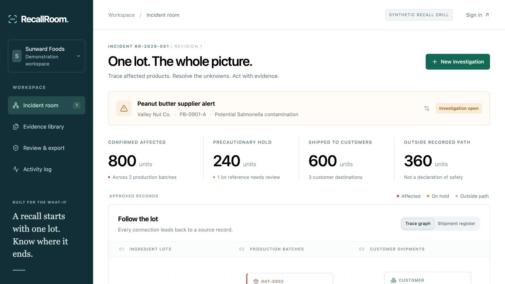

# RecallRoom

**A recall starts with one lot. Know where it ends.**

RecallRoom connects receiving logs, batch sheets and shipment records into an evidence-backed recall investigation. It is built for small food manufacturers and co-packers working with the records they already have.

[Open the Firebase demo](https://recallroom.web.app) · [Watch the demo](https://www.youtube.com/watch?v=J0Gy2FWsm-M) · [Testing instructions](docs/submission/devpost-fields.md) · [Pitch deck](docs/pitch/RecallRoom-pitch.pdf) · [Architecture](docs/architecture.md) · [Commercial thesis](docs/submission/business-model.md)

Created by **Shivam Gupta** for the **Nebius x NVIDIA Global AI Hackathon, Best Apps and Agents**, with AI-assisted implementation, research and testing. Public code is licensed under MIT.

> **Current status:** the Firebase application and real NVIDIA Nemotron 3 Super workflow are verified end to end. The hosted run extracted six lots, five relationships and six shipments with the expected scope, followed by reviewed import, reload, two evidence-backed decisions and verified exports. Inference took 17.562 seconds at an estimated $0.00456. This is one fictional scenario, not a real-world accuracy benchmark. See [the hosted report](docs/evaluation/hosted-nebius.json) and [delivery status](docs/STATUS.md).



## Try the two-minute investigation

1. Open [recallroom.web.app](https://recallroom.web.app). The public drill needs no account. All organizations and source records are fictional; changes last for the current visit.
2. Follow recalled peanut-butter lot `PB-0901-A`. Its confirmed path reaches **800 finished units**, including **600 shipped units** across **three customers**. Another **240 cookies stay on precautionary hold** because the production record says only `PB-Sept`.
3. Select a graph node and inspect its exact source quotation and original document.
4. Choose **Review the source record**. Use the supplied batch clarification to exclude `PB-0901-A → COO-0904`, then confirm `PB-0901-B → COO-0904` in **Review & export**. Each decision needs the supporting document, exact quote and review reason.
5. The cookie hold leaves this recall path. The confirmed count remains 800; the recorded recalled-ingredient balance becomes **50 kg remaining**. The excluded relationship and supporting evidence remain in history.
6. Acknowledge the packet scope and export HTML, CSV or JSON. Open the HTML packet and use its print control to save a PDF. Customer messages are drafts; the app sends none.

The application says **outside the recorded path**, never **safe**. It does not certify food safety, release inventory or replace the recall coordinator.

## Implemented workflow

- **Private investigations:** Firebase Google or email/password sign-in, server-verified ID tokens, account-owned Firestore state and private Google Cloud Storage originals.
- **Source ingestion:** TXT, CSV, JSON and selectable-text PDFs. Plain-text content is derived from original bytes on the server. Browser-extracted PDF text has a separate hash and requires a reviewer to compare it with the original before it can authorize an import or decision.
- **NVIDIA extraction adapter:** schema-guided prompts to Nebius Token Factory with strict server validation, bounded retries, usage recording, daily quotas and asynchronous Cloud Tasks execution. The exact schema is in the ordinary chat prompt; server checks validate JSON, source evidence and supported CSV coverage before import. Provider `response_format` constraints are disabled. The real hosted workflow and three direct-provider fixture variants passed, with development failures retained in the evaluation reports.
- **Human approval:** model proposals remain separate from approved records. Invalid citations, references, cycles, units, balances and duplicate identities block import.
- **Deterministic tracing:** confirmed and possible paths, unknown-input holds, multi-hop propagation, repacking without double counting, and ingredient balances that retain uncertainty as ranges.
- **Reviewable decisions:** exclusions preserve the original relationship, quotation, reviewer, reason, timestamp and revision.
- **Portable output:** escaped HTML/PDF-ready packets, formula-neutralized CSV, JSON snapshots and unsent customer-specific drafts.
- **Browser tools:** `read_recall_scope` and `inspect_recall_record` expose the same visible investigation through WebMCP where supported.

## Run locally

Prerequisites: Node.js **22.13+** and npm. The public synthetic drill does not need a model credential.

```bash
git clone https://github.com/shi1720/Nebius-x-NVIDIA.git
cd Nebius-x-NVIDIA
npm ci
cp .env.example .env
npm run dev
```

Open `http://127.0.0.1:5173`. To develop the private workflow, configure your own Firebase project, enable Google or email/password authentication, and put its public web configuration in `public/firebase-config.json`. Authorize the local hostname in Firebase Authentication. Never put a service-account key or model credential in that public file.

The API uses Google Application Default Credentials and the configured cloud resources. An emulator-only private workflow is not supplied. Use a dedicated development project and synthetic data. Configure these server values in your ignored `.env`:

```dotenv
GOOGLE_CLOUD_PROJECT=your-firebase-project-id
STORAGE_BUCKET=your-private-evidence-bucket
APP_ORIGIN=http://127.0.0.1:5173
```

Start the two development servers in separate terminals:

```bash
# API on port 3000; requires authorized Google Application Default Credentials
npm run dev:api
```

```bash
# Static frontend on port 5173
VITE_API_ORIGIN=http://localhost:3000 npm run dev
```

Use the exact frontend origin configured in `APP_ORIGIN`. API mutations reject other origins. Private extraction also needs the Cloud Tasks settings described in [operations](docs/operations.md); it is not an inline development shortcut.

## Enable real NVIDIA inference

Create a credential in [Nebius Token Factory](https://tokenfactory.nebius.com/project/api-keys), then set the server-side environment:

```dotenv
NEBIUS_API_KEY=your_key
NEBIUS_BASE_URL=https://api.tokenfactory.nebius.com/v1/
NEBIUS_MODEL=nvidia/nemotron-3-super-120b-a12b
NEBIUS_DAILY_USER_LIMIT=20
NEBIUS_DAILY_GLOBAL_LIMIT=100
```

Production keys belong in the server's secret configuration. Never commit them or add them to a `VITE_` variable. After configuration, run:

```bash
npm run test:live
```

This makes **metered real provider calls** on synthetic documents, validates the model catalog and writes a sanitized result to `docs/evaluation/live-nebius.json`. A missing key exits with a visible blocker. Mock tests and the public sample cannot establish live model execution or real-world extraction accuracy.

In the app, sign in, create an empty investigation, upload records and choose **Extract with Nemotron**. Review the proposal before **Import reviewed records**, then select the recalled lot. The queued request has a visible status; a failed extraction leaves approved records unchanged.

## Test and build

```bash
npm run typecheck
npm test
npm run build:api
npm run build:web
```

The current automated suite has **41 passing tests**. The graph checks include comparison with an independent fixed-point oracle over 150 generated graphs. Provider-contract tests use explicit mocks.

The Firebase acceptance suite exercises the deployed API with real disposable Firebase accounts and synthetic records:

```bash
RECALLROOM_API_URL=https://recallroom-api-812985487554.us-central1.run.app node scripts/test-firebase-api.mjs
```

It checks authentication, account isolation, persistence, uploads, source quotations, review actions, exports, errors and cleanup. It does not call a model or replace browser testing. See the generated [Firebase report](docs/evaluation/firebase-api.json) and [current status](docs/STATUS.md) for the actual latest result.

`npm run test:quota`, `npm run test:api` and `npm run db:local` refer to the previous SQLite/Cloudflare implementation. They remain historical tooling and do not verify or initialize the active Firebase application. Earlier CI results are historical, not evidence that the Firebase migration passed CI.

## Hosting

The active public application is [recallroom.web.app](https://recallroom.web.app), built as a static Vite/React frontend on **Firebase Hosting**. A **Next.js API on Cloud Run** verifies Firebase credentials and controls all private data access. Firestore holds investigation state; a private Google Cloud Storage bucket holds originals. Cloud Tasks dispatches authenticated background extraction work.

Firebase project `recallroom-ai-2026` contains Authentication, Hosting and Firestore. The isolated API service, task queue and evidence bucket use the existing billed Google Cloud project `granted-ai-2026`. These identifiers are infrastructure names; the product is RecallRoom. No Sites, D1 or R2 binding is used by the active runtime.

`npm run deploy` runs the repository's Firebase deployment script. Read [operations](docs/operations.md) before deploying to a different account or project. Model inference uses NVIDIA Nemotron on Nebius Token Factory. The sanitized live evaluation records the model, endpoint, actual token usage, latency and scope comparison separately from the Firebase hosting checks.

## Commercial scope and limits

The initial buyer hypothesis is a quality manager at a small food manufacturer or co-packer, with consultants as a potential channel. Recurring readiness drills can make the workflow useful between incidents. **$99 per site per month is an unvalidated pricing hypothesis**, not traction or a billing feature. Existing products such as FoodDocs, Mar-Kov and TraceGains already address food-safety or traceability workflows.

The MVP supports 12 documents and 90,000 extracted characters per investigation, 2 MB files, up to 100 lots, ingredient quantities in kg and finished goods in whole units. Scanned-image OCR, ERP connectors, team roles, billing, automatic messaging, regulatory certification and independently validated real-world extraction performance are not implemented. It is an evaluated MVP, not a certified food-safety system.

Coverage detects missing supported CSV rows, but does not prove candidate completeness or semantic correctness. Review every ambiguous input against original sources before import. Missing mandatory facts block import until source correction; shipment dates remain required.

## Attribution

MIT © 2026 **Shivam Gupta**. Shivam set the objectives, product direction, commercial constraints and quality bar. Implementation, research and testing were AI-assisted. The demo uses disclosed neutral synthetic narration; it does not imitate Shivam's voice. No customer interviews, business results or unverified manual contributions are attributed to him. The project started September 16, 2026.

Third-party packages retain their own licenses. See [third-party notices](THIRD_PARTY_NOTICES.md).

## Recorded walkthrough

Watch the [captioned 2:30 demo](https://recallroom.web.app/demo.html). It uses actual captured application screens and a disclosed AI voice. The recording shows the actual hosted NVIDIA proposal and review workflow. [Narration and production notes](docs/video/README.md).
