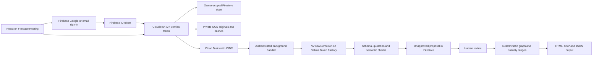

# Architecture

The active deployment uses Firebase Hosting, Firebase Authentication, Firestore, Google Cloud Storage, Cloud Run and Cloud Tasks. Legacy Sites, D1 and R2 files are not the current runtime.

## Trust boundaries

**AI:** interprets source text into proposed lots, consumption links and shipments. It has no tools, application credentials or write access. Every proposed record requires a source document and exact quotation. Quote matching does not establish semantic truth, so a human checks identities, amounts and relationships. The adapter is implemented; live NVIDIA execution is not yet verified.

**Code:** validates schema, references, source ownership, quotations, cycles, units, physical balances and revisions. Confirmed links propagate confirmed exposure; possible links propagate precautionary holds. A confirmed path dominates an alternative possible path. Unknown production inputs remain held. Intermediate consumption is subtracted so repacking does not count output twice.

**Human:** selects recalled lots, compares PDF text with originals, approves proposals, resolves uncertainty using cited evidence, assesses record completeness and controls operational actions. The app does not release stock or send customer messages.

## Authentication and access

The static public route is an ephemeral synthetic drill. Private workspaces use Firebase Google or email/password sign-in. The browser attaches a Firebase ID token to API requests. The server verifies its signature, project and revocation status using Firebase Admin before every account lookup. Legacy `oai-authenticated-*` headers do not establish identity.

The Cloud Run API accepts the exact frontend origin configured in `APP_ORIGIN`; mutating requests require it. Private Firestore and storage operations happen through the server. Firestore client rules deny direct document access. Original files are served only after an owner-scoped investigation lookup. The browser Firebase configuration identifies a public web app and contains no administrative credentials.

## Storage and consistency

Firestore in `recallroom-ai-2026` stores account-owned investigations, revisions, audit history, extraction state and daily quota counters. Original uploads live in a private Google Cloud Storage bucket in `granted-ai-2026`. The API uses an authorized service identity for those resources.

Text files are decoded from original bytes on the server. Selectable-text PDFs are extracted in the browser with a separate text SHA-256 and remain unverified until a reviewer attests comparison with the original. Hashes identify content; they do not authenticate a signature or prove a record is true.

Firestore transactions reserve coupled per-user and global quotas, validate ownership and source revision, create a job and lock the investigation. Rejected reservations do not consume budget. Approved-state changes reject stale revisions or an active extraction. Serialized investigation state is bounded below Firestore's document size limit.

## Asynchronous extraction

The analyze endpoint reserves a job, enqueues it and returns its identifier. Cloud Tasks sends an OIDC-authenticated request to the background handler. That handler validates the expected audience and service-account identity. The queue permits two concurrent dispatches. Its dispatch deadline and handler duration are 180 seconds; the model adapter separately has a 90-second total inference budget.

A Firestore transaction claims only queued, current jobs. Duplicate deliveries do not start another call. The browser polls status. Completion attaches the proposal only if the investigation still has the matching job and source revision. A failed model call does not change the approved graph. A five-minute stale-job window permits the UI to surface a timeout and retry.

## Model contract

Default model: `nvidia/nemotron-3-super-120b-a12b` through `https://api.tokenfactory.nebius.com/v1/`. The exact JSON Schema for lots, links and shipments is included in the prompt. The final adapter uses ordinary chat generation, without provider-guided decoding, after repeated guided-output failures in development. Strict Zod, citation, duplicate, quantity and supported CSV coverage checks validate the response on the server before human approval. Successful runs record actual model identity, request ID when supplied, prompt version, token usage, latency and an estimated cost.

The adapter has bounded input and output, at most two HTTP attempts for selected transient failures, a 90-second total budget and no silent provider fallback. Invalid JSON, truncation, schema errors, unavailable models and authentication errors are visible failures. Real direct-provider evaluations are retained under `docs/evaluation`. The evaluation history includes rejected incomplete and malformed outputs; individual synthetic passes do not establish general extraction accuracy.

## Deployment topology

- Firebase Hosting: `https://recallroom.web.app`.
- Firebase Authentication and Firestore project: `recallroom-ai-2026`.
- Isolated Cloud Run API: `https://recallroom-api-812985487554.us-central1.run.app`.
- API, Cloud Tasks and private evidence bucket project: `granted-ai-2026`.
- Static frontend: Vite and React. API: Next.js on Node.js.

This separation keeps application hosting independent from the Nebius inference workload. It does not imply that Firebase or Google Cloud counts as Nebius infrastructure.
