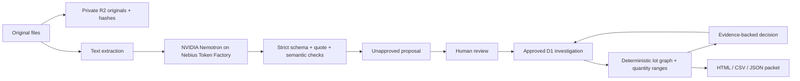

# Architecture

## Boundaries

**AI:** converts heterogeneous text into proposed lots, consumption links and shipments. It does not choose stock-release actions or determine safety. Source documents are untrusted data. The model has no tools, credentials, network destinations or application write capability. Every proposed record needs a source document and exact quote. Quote matching alone does not establish semantic truth, so a human checks extracted identities, amounts and relationships.

**Code:** schema validation, source quotation checks, graph reachability, reference integrity, cycle rejection, units, physical balances, source ownership, exports and budget enforcement. Confirmed reachability propagates only through confirmed edges; possible edges propagate precautionary holds. A confirmed path dominates an alternate possible path. Unlinked production is held as unknown. Intermediate consumption is subtracted from tracked output so repacking does not double count units.

**Human:** selects the recalled lots, compares PDF text with originals, approves extraction, resolves ambiguity with cited evidence, verifies record completeness, and decides all operational actions.

## Storage

D1 stores account-owned investigation state and revision, structured review decisions, audit events and model runs. R2 stores uploaded originals. Plain-text files are decoded from original bytes on the server. PDF text is extracted in the browser, stored with a separate text SHA-256, and explicitly unverified until a reviewer attests comparison with the original. SHA-256 provides a content identifier, not a claim of digital-signature authenticity.

`inference_jobs` records a budgeted attempt and single-investigation lock in one atomic SQL statement. A rejected reservation consumes no budget. The same statement validates owner and source revision. Approved state writes reject stale revisions and active extraction locks. A completed model result remains recorded in the job even if saving the draft fails; operator recovery is described in operations. Deleting an investigation redacts retained job output while preserving attempt metadata for daily quota enforcement.

## Model contract

Default: `nvidia/nemotron-3-super-120b-a12b` via `https://api.tokenfactory.nebius.com/v1/`. A strict JSON schema describes lots, links and shipments; Zod and domain checks validate responses independently. The server records model identifier, provider request ID, prompt version, token usage, latency and estimated cost. There are no credentials in browser bundles.

A request has a 90-second wall-clock inference budget, at most two HTTP attempts for selected transient errors, bounded output, input limits and no silent fallback. Invalid JSON/schema, truncated responses, unavailable models and authentication failures produce actionable errors and never import records.

## Authentication and deployment

Public `/` is an ephemeral synthetic drill. `/workspace` initiates platform-owned ChatGPT sign-in. API routes require authenticated identity and use its user ID in every owner lookup. Mutations require same-origin requests. The platform gateway must strip forged identity headers and block direct untrusted access to the Worker origin. The local gateway implements the same header-stripping boundary with an explicitly local mock login.

D1/R2 provide durable infrastructure, but this MVP does not include multi-user organizations, external identity providers or a full administrative compliance program. An open-source deployment to a different host must supply an equivalent trusted authentication boundary before exposing private data.
